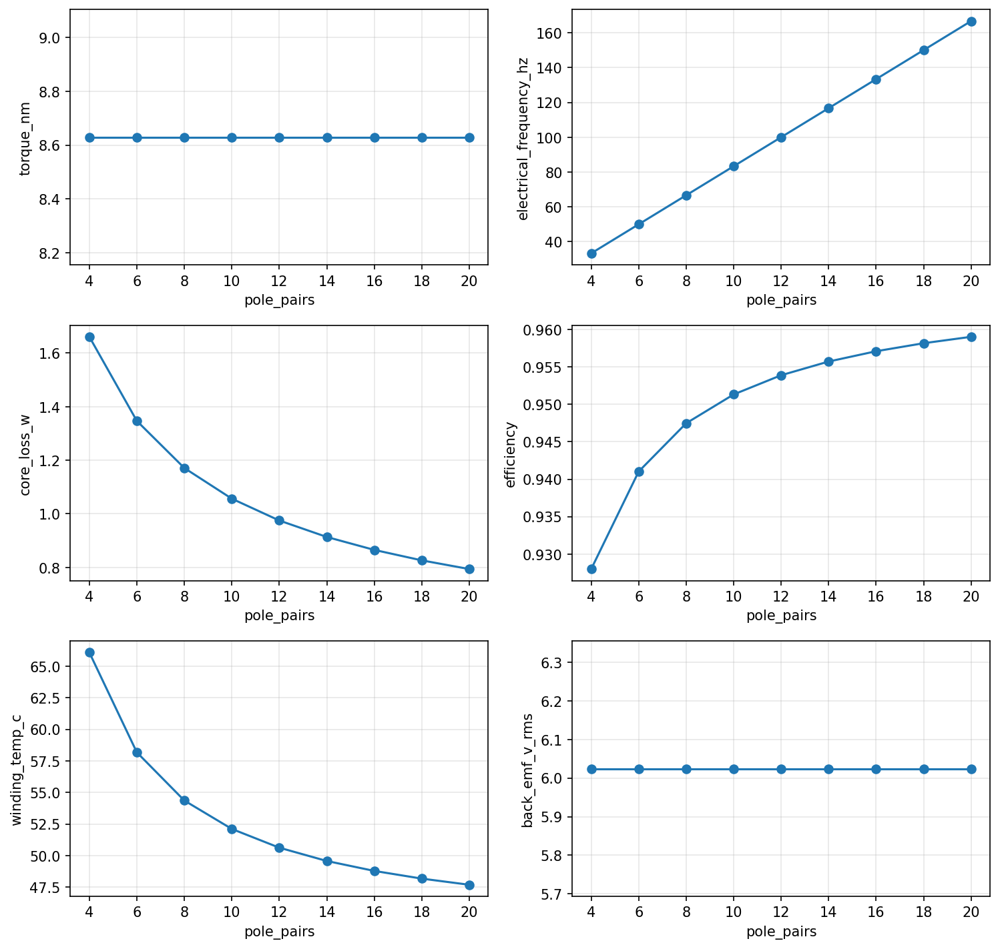

# axfluxmdo

> Open-source Python toolkit for parametric modeling, simulation, visualization, and
> multidisciplinary design optimization of axial-flux permanent-magnet motors.

[](https://github.com/jman4162/axfluxmdo/actions/workflows/ci.yml)
[](LICENSE)


`axfluxmdo` is a **reusable science layer** that sits above expert motor designers and
high-fidelity FEA — not a replacement for either. It provides parametric axial-flux
geometry, fast analytical physics models, constraint visualization, and (in later phases)
solver automation and Pareto-front optimization, so that design tradeoffs can be explored
systematically instead of by intuition-only iteration.

**Phase 1 (current):** the analytical workbench — a parametric motor object, an
energy-consistent torque/back-EMF/loss/thermal model, constraint evaluation, parameter
sweeps, and 2D geometry visualization. Evaluating a design takes microseconds, so it is
suitable for wide design-space exploration.

## Install

```bash
git clone https://github.com/jman4162/axfluxmdo.git
cd axfluxmdo
pip install -e ".[dev]"
```

## Quickstart

```python
from axfluxmdo import AxialFluxMotor, OperatingPoint
from axfluxmdo.models import AnalyticalModel
from axfluxmdo.viz import plot_geometry

motor = AxialFluxMotor(
    outer_radius=0.08,      # m
    inner_radius=0.025,     # m
    air_gap=0.0008,         # m
    pole_pairs=14,
    phases=3,
    turns_per_phase=24,
    fill_factor=0.45,
    magnet_thickness=0.004,        # m
    back_iron_thickness=0.006,     # m
)

op = OperatingPoint(speed_rpm=500, current_rms=25, dc_bus_voltage=48)

result = AnalyticalModel().evaluate(motor, op)
print(result)
plot_geometry(motor, show=True)
```

```text
AnalyticalResult
  torque:            8.629 N·m
  torque density:    2.364 N·m/kg
  back-EMF (rms):    6.02 V/phase
  elec frequency:    116.7 Hz
  air-gap B:         1.016 T
  current density:   4.04 A/mm²
  copper loss:       20.0 W
  core loss:         0.91 W
  efficiency:        0.9557
  winding temp:      49.6 °C
  mass:              3.651 kg
  constraints:
    winding_temp_c: 49.57 <= 140 [OK, margin +64.6%]
    electrical_frequency_hz: 116.7 <= 1000 [OK, margin +88.3%]
    current_density_a_mm2: 4.042 <= 10 [OK, margin +59.6%]
    line_voltage_v: 10.9 <= 33.94 [OK, margin +67.9%]
    core_flux_density_t: 0.6696 <= 1.6 [OK, margin +58.2%]
    magnet_temp_c: 65 <= 80 [OK, margin +18.8%]
```


## Pole-pair tradeoff in four lines

```python
from axfluxmdo.sweeps import sweep_pole_pairs

sweep = sweep_pole_pairs(motor, op, pole_pairs=range(4, 21, 2))
sweep.plot(show=True)
```



At fixed air-gap field and electrical loading, torque is independent of pole count — the
real tradeoff is yoke saturation at low `p` (p = 4 is infeasible here: the fixed stator
core would need to carry 2.3 T) versus electrical frequency, switching burden, and ripple
at high `p`. See [`examples/`](examples/) for executed notebooks.

## What's in the model (Phase 1)

- **Magnetics:** magnet load-line air-gap flux density with temperature-derated
  remanence, fundamental-harmonic flux linkage; torque and back-EMF derived from the same
  flux linkage so the power balance `m·E·I = T·ω` holds to machine precision (enforced by
  tests).
- **Losses:** copper loss with resistance–temperature coupling, two-term Steinmetz core
  loss (M-19 coefficients pinned to datasheet values), mechanical-loss placeholder.
- **Thermal:** closed-form steady-state lumped RC winding temperature including the
  copper-loss/temperature fixed point, with thermal-runaway detection.
- **Constraints:** winding temperature, electrical frequency, current density, inverter
  voltage, yoke saturation, magnet temperature — each reported with normalized margin.
- **Materials:** NdFeB grades (N35/N42/N48/N42SH), M-19 29ga steel, copper.
- **Sweeps & viz:** one-line parameter sweeps over any design field, front-view and
  cross-section geometry plots.

## Development

```bash
pip install -e ".[dev]"
pytest                       # full suite
ruff check . && ruff format --check .
```

## Roadmap

| Phase | Scope | Status |
| ----- | ----- | ------ |
| 1 | Analytical workbench: parametric motor, torque/EMF/losses/thermal RC, constraints, pole-pair sweep, geometry viz | ✅ |
| 2 | 2.5D annular slice model: radius-dependent flux/loading/losses, air-gap & runout sensitivity, efficiency maps | — |
| 3 | MDO: OpenMDAO components, pymoo Pareto optimization, sensitivity analysis | — |
| 4 | External solver integration: Gmsh export, GetDP/Elmer pipelines, sim-to-analytical residuals | — |
| 5 | Surrogates & Bayesian optimization for expensive design loops | — |

## Non-goals

- No custom FEM solver — geometry/mesh export targets open tools (Gmsh, GetDP/ONELAB, Elmer).
- No full transient 3D EM FEA / CFD / structural / inverter-switching simulation in v1.
- No dependencies on proprietary tools (Motor-CAD, Ansys Maxwell, COMSOL).
- Torque density is never optimized alone — thermal headroom, ripple, controllability, and
  manufacturability are co-equal objectives.

## License

[MIT](LICENSE)
