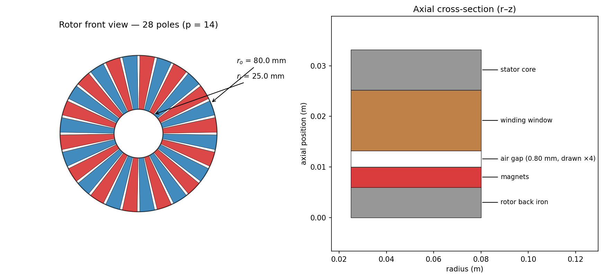

# Getting started

## Install

```bash
pip install axfluxmdo                  # core: analytical + annular models, 2D viz
pip install "axfluxmdo[opt]"           # + pymoo / OpenMDAO / scikit-learn optimization
pip install "axfluxmdo[fea]"           # + gmsh mesh export
pip install "axfluxmdo[viz3d]"         # + PyVista 3D rendering/animations
```

Python ≥ 3.10. The core install depends only on numpy and matplotlib.

!!! note "GetDP is a binary, not a pip package"
    The FEA pipeline drives [GetDP](https://getdp.info) as an external
    executable. Install it via the [ONELAB bundle](https://onelab.info) or a
    standalone build, and either put `getdp` on your `PATH` or set
    `AXFLUXMDO_GETDP=/path/to/getdp`. Everything else works without it;
    solver-dependent tests and examples skip or fall back to committed golden
    results.

## First evaluation

Define a motor by its primary design vector (SI units), pick an operating
point, and evaluate:

```python
from axfluxmdo import AxialFluxMotor, OperatingPoint
from axfluxmdo.models import AnalyticalModel
from axfluxmdo.viz import plot_geometry

motor = AxialFluxMotor(
    outer_radius=0.08,      # m
    inner_radius=0.025,     # m
    air_gap=0.0008,         # m
    pole_pairs=14,
    phases=3,
    turns_per_phase=24,
    fill_factor=0.45,
    magnet_thickness=0.004,        # m
    back_iron_thickness=0.006,     # m
)

op = OperatingPoint(speed_rpm=500, current_rms=25, dc_bus_voltage=48)

result = AnalyticalModel().evaluate(motor, op)
print(result)
plot_geometry(motor, show=True)
```

```text
AnalyticalResult
  torque:            8.629 N·m
  torque density:    2.364 N·m/kg
  back-EMF (rms):    6.02 V/phase
  elec frequency:    116.7 Hz
  air-gap B:         1.016 T
  current density:   4.04 A/mm²
  copper loss:       20.0 W
  core loss:         0.91 W
  efficiency:        0.9557
  winding temp:      49.6 °C
  mass:              3.651 kg
  constraints:
    winding_temp_c: 49.57 <= 140 [OK, margin +64.6%]
    electrical_frequency_hz: 116.7 <= 1000 [OK, margin +88.3%]
    current_density_a_mm2: 4.042 <= 10 [OK, margin +59.6%]
    line_voltage_v: 10.9 <= 33.94 [OK, margin +67.9%]
    core_flux_density_t: 0.6696 <= 1.6 [OK, margin +58.2%]
    magnet_temp_c: 65 <= 80 [OK, margin +18.8%]
```



Key ideas visible already:

- The motor is a frozen dataclass. Variants are made with
  `dataclasses.replace(motor, air_gap=0.001)`, the same mechanism sweeps and
  optimizers use, so nothing is ever mutated.
- Every result carries its constraint margins. `result.feasible` is the
  single boolean the optimizers honor; each named constraint reports a
  normalized margin.
- Results are flat dictionaries too. `result.to_dict()` keys
  (`torque_nm`, `efficiency`, `winding_temp_c`, ...) are a stable interface
  with short aliases (`torque_density` → `torque_density_nm_kg`) used
  throughout the optimization grammar.

## Sweep something

```python
from axfluxmdo.sweeps import sweep_parameter, sweep_pole_pairs

sweep = sweep_pole_pairs(motor, op, pole_pairs=range(4, 21, 2))
sweep.plot(show=True)

# dotted paths reach nested fields, e.g. manufacturing tolerances:
runout = sweep_parameter(motor, op, "tolerances.runout_m", [0, 1e-4, 2e-4, 3e-4])
```

## Optimize

```python
from axfluxmdo.optimize import optimize_pareto       # pip install "axfluxmdo[opt]"

study = optimize_pareto(
    motor, op,
    variables={
        "outer_radius": (0.05, 0.12),
        "pole_pairs": [8, 10, 12, 14, 16, 18, 20],
        "air_gap": (0.0005, 0.0015),
        "fill_factor": (0.30, 0.60),
    },
    objectives=["maximize_torque_density", "maximize_efficiency", "minimize_mass"],
    constraints=["winding_temp_c < 140", "electrical_frequency_hz < 1000"],
)
print(study.summary())
```

Tuples are continuous bounds, lists are discrete choices, objectives and
constraints are strings over the result keys. Every returned design is
feasible. See the [optimization guide](guide/optimization.md) for the full
grammar and [Bayesian optimization](guide/surrogates-bo.md) for expensive
objectives.

## Where next

- The [User Guide](guide/analytical-model.md) derives the physics each layer
  implements, with the equations and their code locations.
- The [Examples](examples/01_basic_axial_flux_motor.ipynb) are executed
  notebooks; every figure on this site regenerates from them.
- [Limitations](limitations.md) states what the fast models leave out, with
  FEA-measured error bars.
