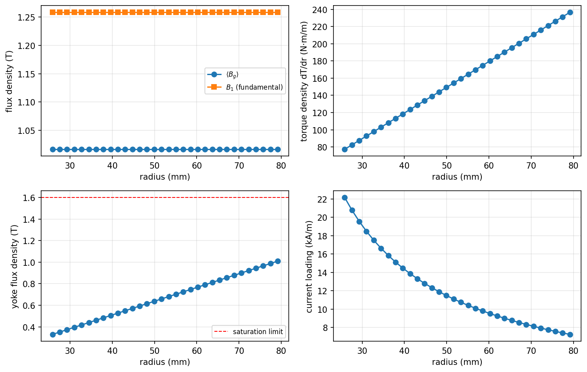
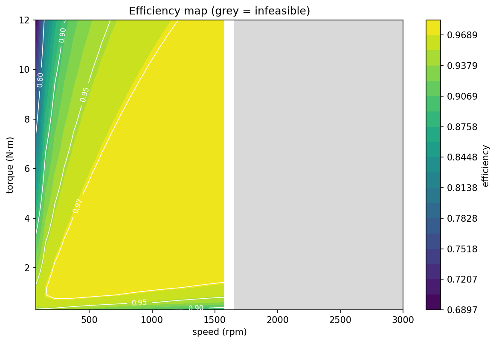

# The 2.5D annular model (Layer 2)

The annular model splits the disk machine into radial slices and evaluates
the field, torque contribution, yoke loading, and core loss **per slice**. It
adds the physics that is genuinely radius-dependent and nothing else, which
is why it agrees with the analytical model to machine precision for a
perfect machine.

Code: [`axfluxmdo.models.annular_2p5d`](../api/models.md),
[`axfluxmdo.geometry.tolerances`](../api/geometry.md),
[`axfluxmdo.materials.magnetic`](../api/materials.md) (runout averages).

---

## 1. Why the slice sum is exact, not approximate

For slice $k$ with exact annulus area $dA_k = \pi(r_{k+1}^2 - r_k^2)$, the
per-slice flux linkage is

$$
d\lambda_k = \frac{k_w N\, B_1(r_k)\, dA_k}{\pi p},
\qquad
\lambda = \sum_k d\lambda_k .
$$

Torque and EMF come from the summed $\lambda$ exactly as in
[Layer 1](analytical-model.md). Because the analytical model's
$\lambda \propto B_1 A_g$ is **linear in area**, and $\sum_k dA_k = A_g$
exactly, a radius-uniform $B_1$ gives the identical $\lambda$ at any slice
count, with no discretization error at all. Only quantities nonlinear in radius
(core loss via $B_y(r)^{1.68}$, the saturation maximum) are discretized, and
they converge fast. The test suite pins single-slice parity on **every**
output key at 10⁻¹² relative.

The energy identity $m E I = T \omega_m$ survives unchanged because both
quantities still derive from the one summed $\lambda$, per slice and in
aggregate.

## 2. Radius-dependent yoke loading: why saturation binds at $r_o$

The local pole pitch grows with radius, $\tau_p(r) = \pi r / p$, so each
pole's flux return through the yoke grows too:

$$
B_y(r) \;=\; \frac{B_g(r)\,\alpha(r)\, \pi r}{2\, p\, t_\mathrm{core}\, k_\mathrm{stack}} .
$$

The yoke flux density is largest at the outer radius, so the analytical
model's mean-radius proxy underestimates the true maximum. The annular
model's saturation constraint uses $\max_k B_y(r_k)$; the practical
consequence appeared immediately in validation: a $p = 8$ variant that
Layer 1 called feasible saturates at 1.77 T at $r_o$ against a 1.6 T limit.

## 3. Manufacturing imperfections

`GapImperfections` models three deviations of the running gap
(all in meters, attached to the motor so they sweep and optimize like any
design variable):

$$
g(r, \theta) = g_0 + \underbrace{\Delta g}_{\text{offset}}
 + \underbrace{c\,\frac{r - r_m}{r_o - r_i}}_{\text{coning}}
 + \underbrace{\delta \cos\theta}_{\text{runout}} .
$$

Offset and coning are axisymmetric, so they enter the per-slice load line
directly. Runout varies around the circumference and needs an average.

### The runout average, in closed form

The load line is a Möbius function of the gap,
$B(g) = B_r h_m / (a + b\cos\theta)$ with $a = h_m + \mu_r \bar g$ and
$b = \mu_r \delta$. Its circumferential mean uses the classic integral

$$
\frac{1}{2\pi}\int_0^{2\pi} \frac{d\theta}{a + b\cos\theta}
= \frac{1}{\sqrt{a^2 - b^2}} ,
$$

giving

$$
\langle B \rangle_\theta \;=\; \frac{B_r\, h_m}{\sqrt{(h_m + \mu_r \bar g)^2 - (\mu_r\delta)^2}} .
$$

### The counterintuitive sign: Jensen's inequality

$B(g)$ is **convex** in $g$ (second derivative positive). Jensen's
inequality then guarantees

$$
\langle B(\bar g + \delta\cos\theta) \rangle \;\ge\; B(\bar g) :
$$

runout slightly increases mean flux and mean torque. The closed form
confirms it, since $\sqrt{a^2-b^2} < a$. Runout's real penalties are
elsewhere:

- a 1/rev torque modulation, reported as `torque_ripple_proxy`
  $= (\lambda_+ - \lambda_-)/(\lambda_+ + \lambda_-)$ from the gap extremes;
- axial-force modulation on the bearings.

This sign is test-pinned. If a future change makes runout reduce mean
torque, the model is wrong, not the test.

## 4. Axial force from the Maxwell stress tensor

The magnetic normal stress on the stator face is $B^2/2\mu_0$. Integrated
over the magnet-covered annulus:

$$
F_z \;=\; \sum_k \frac{\langle B_g^2\rangle_k}{2\mu_0}\, \alpha_k\, dA_k ,
$$

with $\langle B^2\rangle$ also closed-form under runout
($\propto a/(a^2-b^2)^{3/2}$). For the reference motor this is about 5.6 kN
of one-sided pull, the defining mechanical burden of a single-gap topology;
a double-gap machine balances it. The result string reports this
explicitly.

## 5. Efficiency maps

Because the model has no saturation, torque is linear in current and
torque-per-amp is speed-independent: one probe evaluation inverts the map,
then each (speed, torque) cell is a single model call. Cells violating any
constraint are masked, with the first binding constraint recorded. The grey
wall in the reference map near 1650 rpm is the 48 V bus voltage limit, at
the speed the back-EMF predicts.

---

See [example 03](../examples/03_annular_efficiency_map.ipynb) for the parity
demo, radial profiles, and efficiency map, and
[example 04](../examples/04_air_gap_sensitivity.ipynb) for gap error,
coning, runout (including the Jensen sign), and magnet-arc sweeps.
