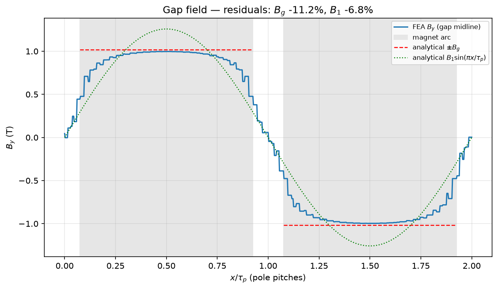

# FEA validation (Layer 3 solvers)

The package never reimplements FEM. It generates geometry and meshes with
**Gmsh**, drives **GetDP** (open-source magnetostatics) on them, and compares
the result against its own analytical layer — publishing the residuals
instead of hiding them.

Code: [`axfluxmdo.solvers.gmsh_export`](../api/solvers.md),
[`getdp_runner`](../api/solvers.md), [`results_parser`](../api/solvers.md),
[`axfluxmdo.validation.sim2real`](../api/validation.md). Requires
`pip install "axfluxmdo[fea]"` + the GetDP binary.

---

## 1. The 2D unrolled approximation

Axial-flux machines are inherently 3D, but unrolling the annulus at the mean
radius $r_m$ turns one pole pair into a 2D planar problem: $x$ is the
circumferential coordinate over $2\tau_p$, $y$ is axial, and the model is
periodic in $x$. The approximation is good when the radial build
$(r_o - r_i)$ is several times the pole pitch and field quantities vary
slowly with radius — exactly the regime where the
[annular model](annular-model.md) treats radius as a parameter, not a field
variable. Radial end effects are outside its scope.

## 2. The magnetostatic formulation

In 2D the flux density derives from a single vector-potential component
$A_z$: $\mathbf B = \nabla \times (A_z \hat z)$, which satisfies
$\nabla\cdot\mathbf B = 0$ identically. With reluctivity $\nu = 1/\mu$ and a
permanent-magnet source of remanence $\mathbf B_r$, Ampère's law becomes

$$
\nabla \times \big( \nu\, (\nabla \times A_z\hat z - \mathbf B_r) \big) = 0 ,
$$

whose weak (Galerkin) form is what the generated GetDP `.pro` file states:
find $A_z$ such that for all test functions $w$,

$$
\int_\Omega \nu\, \nabla A_z \cdot \nabla w \; d\Omega
\;=\; \int_{\Omega_m} \nu\, \mathbf B_r \cdot (\nabla \times w\hat z)\; d\Omega .
$$

Crucially, the magnet constitutive law in the template,
$\mathbf B = \mu_0\mu_r \mathbf H + \mathbf B_r$, is the **identical recoil
line** behind the analytical load line — so any residual between FEA and the
load line is *geometry* (leakage, fringing, finite iron $\mu$), never a
material-model discrepancy.

Boundary conditions: $A_z = 0$ on the outer iron backs (flux confined),
periodic linking of the left/right edges (which requires the mesh nodes to
match — the exporter enforces matched periodic meshing, and a conformality
test guards against cracked interfaces after one bit us in development).

## 3. What the FEA measured

For the reference motor (slotless face, identical materials):

- **under-magnet mean:** −11.2% vs the load line $B_g$,
- **fundamental:** −6.8% vs $B_1$.

The flat top sits just below the analytical line; the *shoulders* — flux
spreading circumferentially as it crosses the gap, and leaking pole-to-pole
between magnets — are what the 1D circuit cannot represent. The load line is
an upper bound, now with measured error bars.

## 4. Carter factor: theory vs measurement

Classical Carter theory corrects the effective gap for slot openings:

$$
k_C = \frac{\tau_s}{\tau_s - \gamma g},
\qquad
\gamma = \frac{(w/g)^2}{5 + w/g},
$$

with slot pitch $\tau_s$ and opening width $w$. For this stator
($w/g \approx 2.5$) it predicts $k_C \approx 1.2$ — but the **measured**
value is $k_C = 1.44$, because the classical formula assumes shallow,
semi-closed slots while this machine has fully open slots as deep as the
winding window. Measuring beats assuming.

The measurement itself cancels the fringing bias by using the
slotless/slotted **ratio**:

$$
k_C \;=\; \frac{ \frac{B_\text{sl}}{B_\text{st}} (h_m + \mu_r g) - h_m }{ \mu_r g } ,
$$

and the closure check holds to four decimals: the load-line ratio with the
measured $k_C$ reproduces the FEA slotless/slotted ratio. Feed it back with
`AnalyticalModel(carter_factor=k_c)`.

## 5. Reproducibility without the binary

GetDP runs are committed as golden tables with provenance headers; examples
and figures regenerate from them when the binary is absent, and an advisory
CI job re-runs the live pipeline (pinned GetDP version) on every push.

---

**Try it:** [example 06](../examples/06_gmsh_export.ipynb) — mesh export,
the live-or-golden solve, the residual report, and the Carter-factor
feedback loop.
