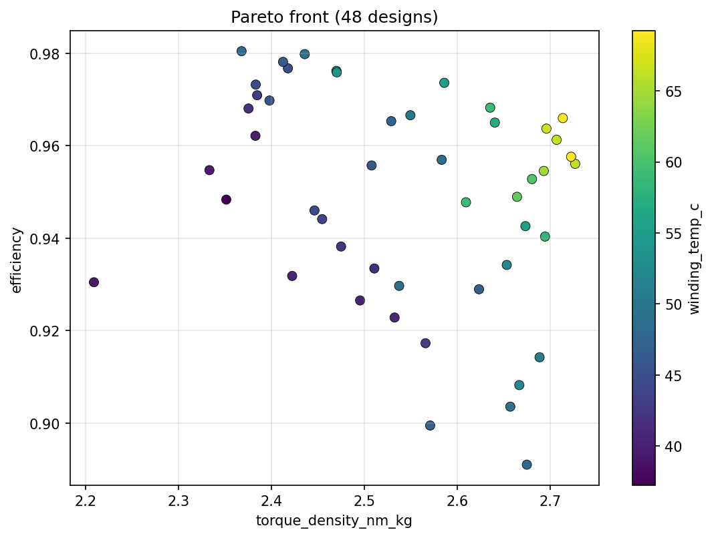
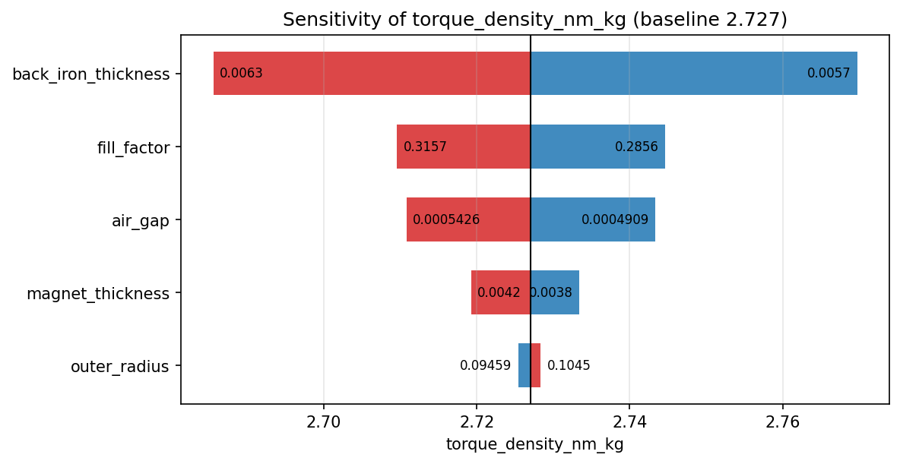

# Pareto optimization & MDO (Layer 3)

The optimization layer turns the microsecond models into design studies:
multi-objective Pareto fronts over mixed continuous/discrete variables,
one-at-a-time sensitivities, and an OpenMDAO component for gradient-based
refinement and larger coupled MDO groups.

Code: [`axfluxmdo.optimize.problem`](../api/optimize.md),
[`pymoo_runner`](../api/optimize.md), [`sensitivity`](../api/optimize.md),
[`openmdao_components`](../api/optimize.md). Requires `pip install
"axfluxmdo[opt]"`.

---

## 1. The problem grammar

`DesignProblem` is the single parsing layer every backend shares:

- Variables: `{"outer_radius": (0.05, 0.12)}`. A 2-tuple is a continuous
  bound (integer bound if the motor field is an int); a list is a discrete
  choice set (`"pole_pairs": [8, 10, ...]`). Dotted paths reach nested
  fields: `"tolerances.runout_m"`.
- Objectives: `"maximize_torque_density"` or `"minimize_mass"`. The
  suffix resolves through the alias map to a stable result key.
- Constraints: `"winding_temp_c < 140"`, parsed to the standard
  $g(x) \le 0$ convention. The models' built-in constraint records are
  enforced *in addition* by default, so optimizer output is always
  `result.feasible`.

Design vectors that violate geometric validity (e.g. $r_i \ge r_o$) are
penalized with large finite values rather than raised; genetic algorithms
bury them through constrained domination.

## 2. Pareto optimality, briefly

A design $x$ dominates $y$ if it is no worse in every objective and
strictly better in at least one. The Pareto front is the set of
non-dominated feasible designs. Any design off the front is beaten in every
objective by some design on it, so the front is the complete answer to a
multi-objective sizing question.

With mixed Real/Integer/Choice variables, the package uses pymoo's
mixed-variable GA with rank-and-crowding survival (the NSGA-II selection
applied to a mixed search space). Rounding a continuous GA onto discrete
choices is deliberately avoided because it breaks duplicate elimination and
choice semantics.

Sign convention: optimizers work in *minimize space* internally
(maximize objectives are negated exactly once, at the boundary); every
user-facing study object reports values with their natural sign. This invariant is
shared with the [BO layer](surrogates-bo.md).

The three-objective reference study renders as x/y position plus color. The
spread below the upper envelope comes from the third objective (mass); all
points are non-dominated in three dimensions. The torque-density optimum and
the efficiency optimum are different machines, which is the argument against
optimizing torque density alone.

## 3. One-at-a-time sensitivities

`compute_sensitivities` perturbs each variable ±5% (clamped to bounds;
discrete variables step one option) and records the output swing, plotted
as a tornado chart. It is a local, one-factor analysis: cheap and interpretable, but blind to
interactions. Use it to rank design levers around a chosen design, not to
certify global behavior.

## 4. OpenMDAO integration

`MotorComponent` wraps the model as an `om.ExplicitComponent` with
finite-difference partials: continuous design variables in, requested result
keys and constraint violations out. The shipped demo runs SLSQP on
torque density with constraints wired as `g ≤ 0`. Discrete variables are
frozen at their baseline, since gradient drivers cannot move them; discrete
search is the GA's job. The component is the doorway to larger coupled MDO groups
(drivetrain, inverter, structure) per the OpenMDAO philosophy.

---

See [example 05](../examples/05_torque_density_optimization.ipynb) for the
full three-objective study, design selection, tornado chart, and SLSQP
refinement.
