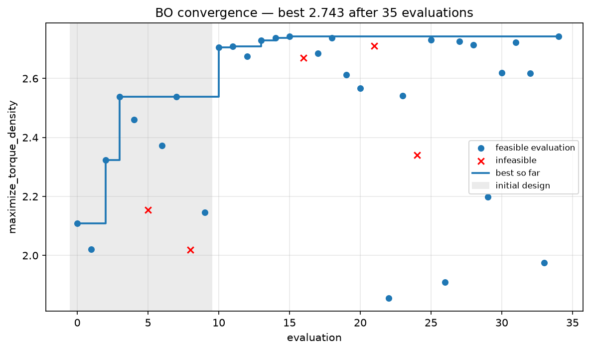
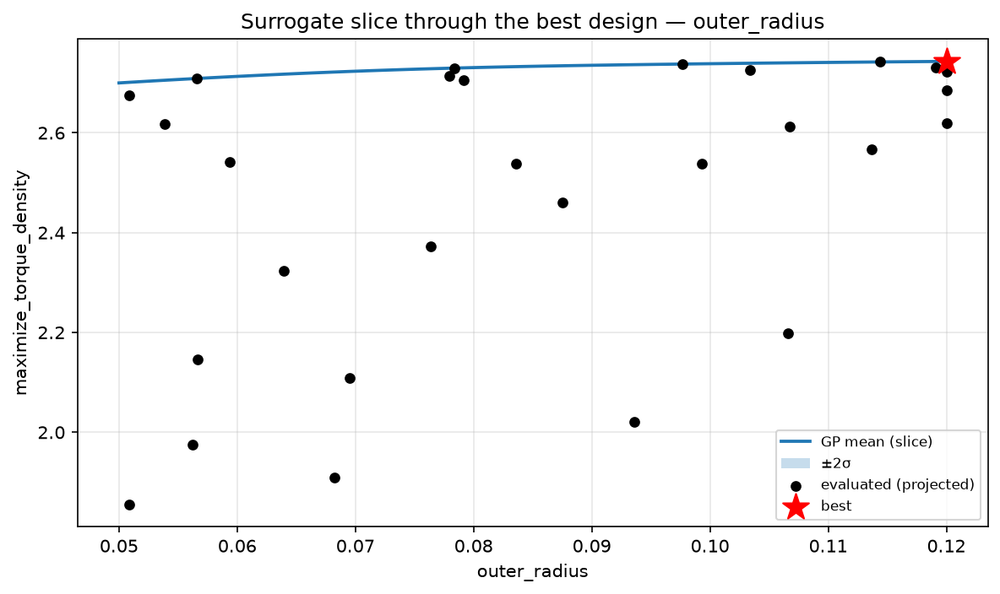

# Surrogates & Bayesian optimization (Layer 5)

When each evaluation is expensive — a GetDP solve, a transient FEA run, a
dyno test — you cannot afford the ~10³ evaluations a genetic algorithm
spends. Bayesian optimization finds comparable designs in **tens** of
evaluations by spending compute on *deciding where to evaluate next*.

Code: [`axfluxmdo.optimize.dataset`](../api/optimize.md),
[`surrogate`](../api/optimize.md), [`bayesopt`](../api/optimize.md),
[`axfluxmdo.viz.bayesopt`](../api/viz.md). Requires
`pip install "axfluxmdo[opt]"` (scikit-learn + scipy).

---

## 1. Gaussian-process regression in five lines

Given $n$ observations $\mathbf y$ at inputs $X$, a GP with kernel
$k(\cdot,\cdot)$ predicts at a new point $x_*$:

$$
\mu(x_*) = \mathbf k_*^\top (K + \sigma_n^2 I)^{-1}\, \mathbf y ,
\qquad
\sigma^2(x_*) = k(x_*,x_*) - \mathbf k_*^\top (K + \sigma_n^2 I)^{-1} \mathbf k_* ,
$$

where $K_{ij} = k(x_i, x_j)$ and $(\mathbf k_*)_i = k(x_i, x_*)$. The mean
interpolates the data; the variance *grows away from it* — the honest "I
don't know" that drives exploration.

The kernel is a **Matérn-5/2 with ARD** (automatic relevance determination —
one length scale per input dimension):

$$
k(x, x') = \sigma_f^2 \Big(1 + \sqrt5 d + \tfrac53 d^2\Big) e^{-\sqrt5 d},
\qquad
d^2 = \sum_j \frac{(x_j - x_j')^2}{\ell_j^2} .
$$

ARD matters here because the feature encoding mixes scales — meters,
unitless fill factors, ordinal pole counts — and per-dimension $\ell_j$ let
the GP learn each variable's true influence after standardization. Length
scales are fit by maximizing the marginal likelihood; trustworthiness is
judged by k-fold cross-validation (`cv_rmse`/`cv_r2`), not by the optimizer's
convergence warnings.

## 2. Expected improvement, derived

Let $y^\*$ be the best (minimize-space) value observed so far. The
improvement at $x$ is $\max(0,\ y^\* - Y)$ where
$Y \sim \mathcal N(\mu, \sigma^2)$ is the GP's belief. Its expectation:

$$
\mathrm{EI}(x) = \mathbb E\big[\max(0, y^* - Y)\big]
= \int_{-\infty}^{y^*} (y^* - y)\, \phi\!\Big(\frac{y-\mu}{\sigma}\Big)\frac{dy}{\sigma} .
$$

Substituting $z = (y^\* - \mu - \xi)/\sigma$ (with a small exploration margin
$\xi$) and integrating by parts:

$$
\boxed{\;
\mathrm{EI}(x) = (y^* - \mu - \xi)\,\Phi(z) \;+\; \sigma\,\phi(z)
\;}
$$

— two terms with clean meanings: *exploitation* (probability-weighted
improvement of the mean) plus *exploration* (reward for uncertainty). EI is
zero where $\sigma \to 0$: the optimizer never re-evaluates what it already
knows. The acquisition is maximized over a seeded candidate pool (half
uniform, half perturbations of the incumbent) — derivative-free and correct
for the mixed continuous/integer/choice space.

## 3. The loop

1. **Initial design**: a Latin hypercube over the continuous/integer box —
   stratified sampling that guarantees one-dimensional coverage that i.i.d.
   uniform sampling does not — plus seeded random draws for choices.
2. Fit the GP; **soft-penalize** infeasible points (worst feasible + 10% of
   the feasible range) rather than injecting the 10⁹ geometry penalty, which
   would destroy the smoothness the GP depends on.
3. Maximize EI; evaluate the winner; append to the
   [`DesignDataset`](../api/optimize.md) (JSON-lines, versioned header —
   every evaluation is a permanent artifact).
4. Repeat; same seed ⇒ identical trajectory (test-pinned determinism).

The result on the reference problem: the GA's torque-density champion
neighborhood reached in **35 evaluations vs ~1200** — and slightly exceeded,
because EI's local perturbation pool polishes the incumbent.




## 4. Uncertainty-aware recommendation

`BOStudy.recommend(k, risk_aversion=κ)` ranks **evaluated, verified-feasible**
designs by the pessimistic score $\mu - \kappa\sigma$ (maximize sense). A
design the surrogate is unsure about ranks below a slightly worse one with
verified neighbors — uncertainty-aware without pretending to certify
unevaluated space.

## 5. Expensive objectives (the point of all this)

Any callable can be the objective; the cheap model still supplies the
constraints:

```python
from axfluxmdo.solvers import solve_open_circuit

def fea_b1(motor, op):
    return {"fea_b1_t": solve_open_circuit(motor, magnet_temp_c=65.0).fundamental_b1_t}

study = bayesian_optimize(
    motor, op,
    variables={"magnet_thickness": (0.002, 0.008), "air_gap": (0.0005, 0.0015)},
    objective="maximize_fea_b1_t",
    expensive_fn=fea_b1,
    n_initial=6, n_iterations=12,
)
```

---

**Try it:** [example 07](../examples/07_bayesian_optimization.ipynb) — the
35-evaluation study, convergence and surrogate-slice plots, dataset
round-trip, and the FEA-objective recipe.
