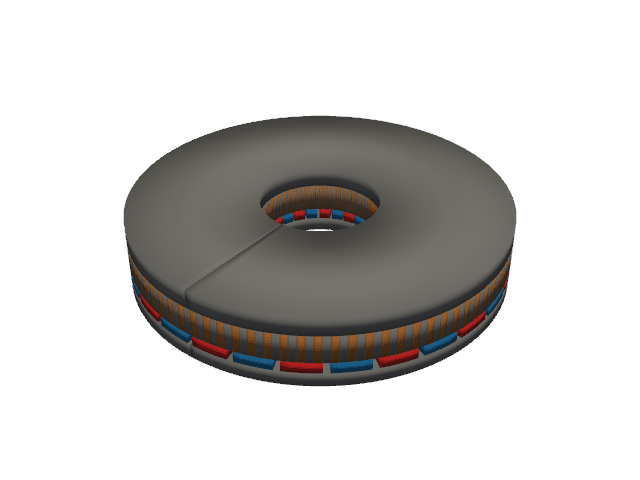

# 3D visualization

The parametric motor renders as a true 3D assembly via PyVista: rotor back
iron, alternating N/S magnets, the slotted stator with copper coils, and the
yoke. Every solid is built from the same `AxialFluxMotor` dimensions the
physics models use.

Code: [`axfluxmdo.viz.pyvista_3d`](../api/viz.md). Requires
`pip install "axfluxmdo[viz3d]"`.

---

## Construction: exact annular sectors

Every component is one primitive: a closed hexahedral annular sector built
as a structured grid over a numpy $(r, \theta, z)$ vertex lattice. Full
rings are 360° sectors; magnets, teeth, slots, and the cutaway are partial
sectors. Vertices lie exactly on the bounding circles, so bounds are exact
and mesh volumes are meaningful: the test suite checks each component's
`.volume` against the motor's analytic volume properties, which agree to
better than 0.1%. VTK boolean operations are not used.

```python
from axfluxmdo.viz import plot_motor_3d, animate_rotation, animate_exploded

plot_motor_3d(motor, show=True)             # interactive cutaway view
animate_rotation(motor, "rotation.gif")     # one full mechanical revolution
animate_exploded(motor, "exploded.gif")     # stack separates and reassembles
```




## Conventions worth knowing

- The cutaway wedge removes stator-side material only, because slicing the
  rotor would cut through a moving part mid-animation.
- Animations are GIF-only. GitHub and this site render GIFs inline; MP4
  would add a binary ffmpeg dependency without documentation benefit.
- `can_render()` probes for a usable GL context in a subprocess (VTK
  segfaults rather than raises without one); mesh construction works
  everywhere, rendering degrades gracefully on headless machines.
- The committed GIFs are regenerated locally via
  [example 08](../examples/08_3d_animation.ipynb); CI smoke-runs the example
  under xvfb.
