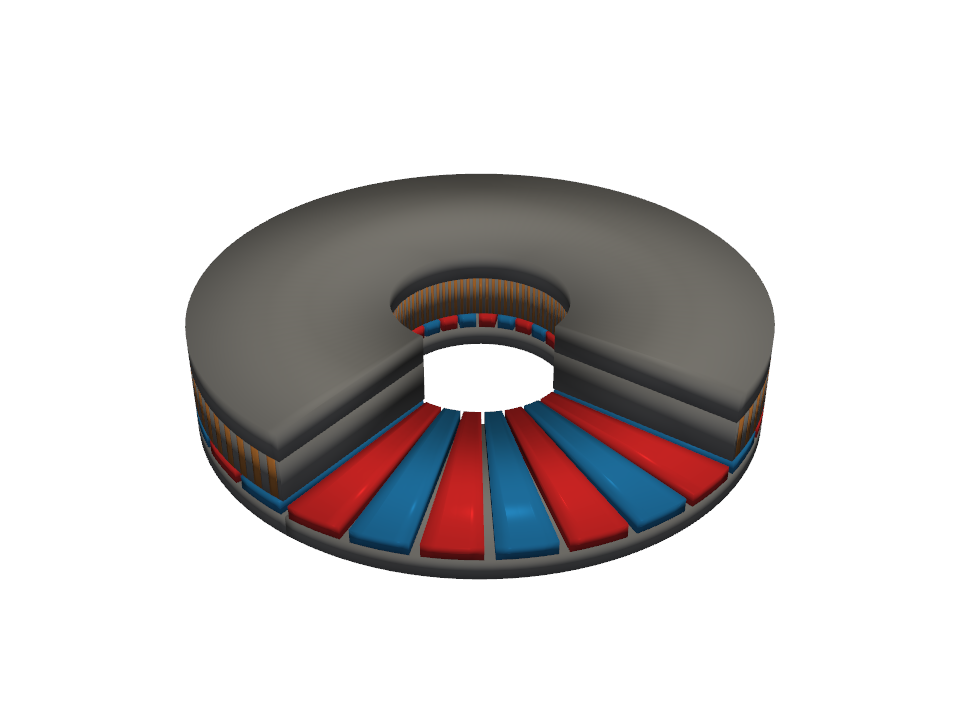

# axfluxmdo

**Parametric modeling, simulation, visualization, and multidisciplinary design
optimization of axial-flux permanent-magnet motors.**

[](https://pypi.org/project/axfluxmdo/)
[](https://github.com/jman4162/axfluxmdo/actions/workflows/ci.yml)
[](https://github.com/jman4162/axfluxmdo/blob/main/LICENSE)

`axfluxmdo` is a design-exploration layer for axial-flux machines. It does not
replace expert designers or high-fidelity FEA; it supplies the fast, validated
models around them: parametric geometry, closed-form and 2.5D physics,
open-source solver automation, and Pareto-front and Bayesian optimization, so
that design tradeoffs are quantified early.



## What's inside

| Layer | What it does | Evaluation cost |
| ----- | ------------ | --------------- |
| [Analytical model](guide/analytical-model.md) | Closed-form torque, back-EMF, losses, thermal, constraints | microseconds |
| [2.5D annular model](guide/annular-model.md) | Radius-resolved fields, manufacturing imperfections, ripple, axial force, efficiency maps | microseconds–ms |
| [Pareto optimization](guide/optimization.md) | Mixed-variable NSGA-style fronts, sensitivities, OpenMDAO | seconds per study |
| [FEA validation](guide/fea-validation.md) | Gmsh + GetDP open-circuit solves, sim-to-analytical residuals | seconds per solve |
| [Surrogates + BO](guide/surrogates-bo.md) | GP surrogates, expected-improvement loops for expensive objectives | tens of evaluations |
| [3D visualization](guide/viz-3d.md) | PyVista assemblies and animations | — |

Every layer validates against the one below it: the annular model reproduces
the analytical model to machine precision in its limit, and the analytical
load line is checked against open-source FEA. The measured residuals are
published in [Limitations](limitations.md).


## Example

```python
from axfluxmdo import AxialFluxMotor, OperatingPoint
from axfluxmdo.models import AnalyticalModel

motor = AxialFluxMotor(
    outer_radius=0.08, inner_radius=0.025, air_gap=0.0008, pole_pairs=14,
)
op = OperatingPoint(speed_rpm=500, current_rms=25, dc_bus_voltage=48)
result = AnalyticalModel().evaluate(motor, op)
print(result)   # torque, efficiency, winding temp, constraint margins...
```

Continue with [Getting Started](getting-started.md), browse the
[worked examples](examples/01_basic_axial_flux_motor.ipynb), or jump to the
[API reference](api/index.md).

## Links

- [PyPI package](https://pypi.org/project/axfluxmdo/)
- [Source on GitHub](https://github.com/jman4162/axfluxmdo)
- [Changelog](changelog.md)
